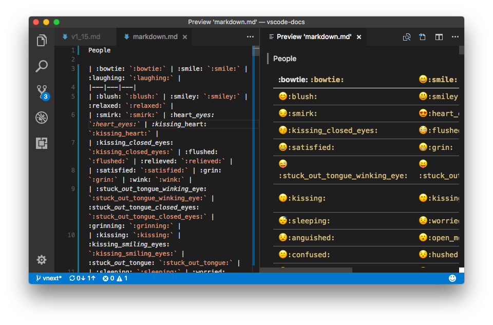
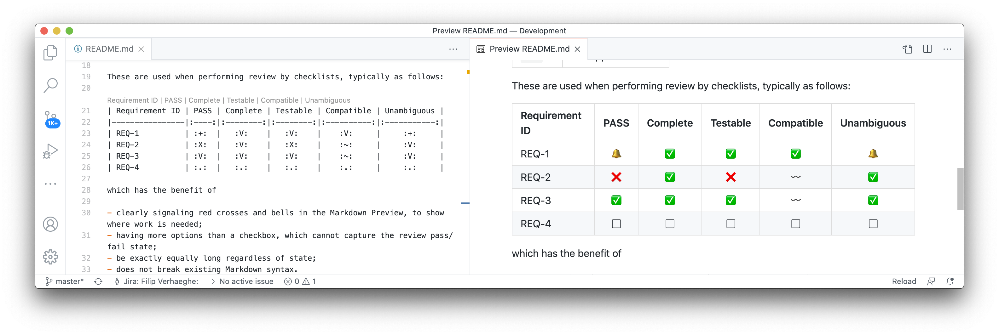

Adds [:emoji:](https://www.webfx.com/tools/emoji-cheat-sheet/) syntax support to VS Code's built-in Markdown preview

# Features 

This extension adds support for [:emoji:](https://www.webfx.com/tools/emoji-cheat-sheet/) syntax to VS Code's built-in markdown preview.

It extends these emoticons by providing the following list of additional marks:

| Syntax | Meaning            |
|--------|--------------------|
| `:.:`  | Check not yet done |
| `:V:`  | Pass               |
| `:+:`  | Pass with remarks  |
| `:X:`  | Fail               |
| `:~:`  | Not applicable     |

These are used when performing review by checklists, typically as follows:

| Requirement ID | PASS | Complete | Testable | Compatible | Unambiguous |
|----------------|:----:|:--------:|:--------:|:----------:|:-----------:|
| REQ-1          | :+:  |   :V:    |   :V:    |    :V:     |     :+:     |
| REQ-2          | :X:  |   :V:    |   :X:    |    :~:     |     :V:     |
| REQ-3          | :V:  |   :V:    |   :V:    |    :~:     |     :V:     |
| REQ-4          | :.:  |   :.:    |   :.:    |    :.:     |     :.:     |

which has the benefit of 

- clearly signaling red crosses and bells in the Markdown Preview, to show where work is needed;
- having more options than a checkbox, which cannot capture the review pass/fail state;
- be exactly equally long regardless of state;
- does not break existing Markdown syntax.

This extension does not allow the box in the Markdown Preview to be clicked. Updating the box must be done in the editor.
